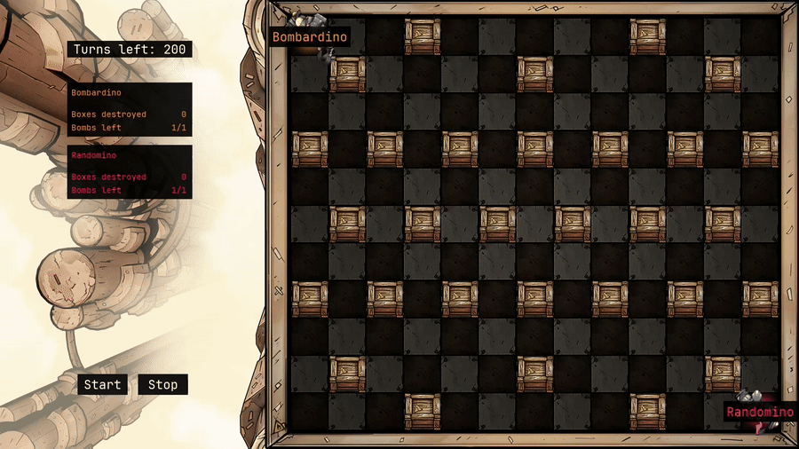

# Hypersonic



This repository contains the runner and solutions for the Artificial Intelligence course's end-of-year competition, part of the Computer Science curriculum at [Unical](https://www.unical.it/) (academic year 2024/2025), specifically the [Hypersonic](https://www.codingame.com/ide/puzzle/hypersonic) theme.

The runner is a [pygame](https://www.pygame.org/) app that takes pluggable agents (the players). These can be Python scripts, executables, and Answer Set Programming programs (ASP). The code to configure the mapping of an external agent and the runner is documented (see `ExecutableAgent` and `AspAgent` in [entities.py](hypersonic/entities.py)).

Writing the solution in ASP was a course requirement. The solutions of all four groups, as well as some testing agents, can be found under [`encodings`](encodings/). To change the agents that will run edit the `active_agents` list in [main](hypersonic/__main__.py), you may use one of the ones already configured in the `AGENTS` dict or add new ones.

If you ever need an ASP syntax file for Vim/Neovim you can find one [here](https://github.com/ormai/dotfiles/blob/main/nvim/syntax/lp.vim).

## Run it with [uv](https://github.com/astral-sh/uv)

```sh
git clone https://github.com/ormai/hypersonic.git
cd hypersonic
uv run python -OO -m hypersonic
```

> [!TIP]
> To run the project in debug mode simply omit the `-OO` interpreter option when running it.

To test the project instead run

```sh
uv run pytest
```

## Credits

The runner is licensed under the MIT license. The ASP programs under `encodings` are copyrighted by their respective authors.
